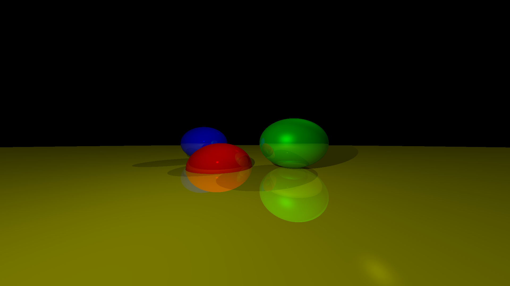

# BareBonesRaytracer

A software raytracer written in C++ with a real-time interactive preview powered by SDL3 and Dear ImGui. Built from scratch as a learning project, covering the core theory of ray-sphere intersection, diffuse and specular shading, shadows, and reflections.

---

## Demo

<!-- Attach your video here. You can embed it one of two ways:
     1. GitHub-hosted video (drag and drop the file into this README on GitHub.com):
        GitHub will generate a link like: https://github.com/user-attachments/assets/<uuid>.mp4
        Then embed it as:
        https://github.com/user-attachments/assets/<uuid>.mp4

     2. YouTube / external host:
        [](https://www.youtube.com/watch?v=YOUR_VIDEO_ID)
-->

---

## Renders

| Scene | Output |
|-------|--------|
| Complete scene with reflections |  |
| Shadow pass |  |
| Early trial render |  |
| Single shadow test |  |

---

## Features

- Ray-sphere intersection using the quadratic formula
- Diffuse (Lambertian) and specular (Phong) shading
- Hard shadows with shadow-ray bias to prevent acne
- Mirror reflections with configurable depth (default: 3 bounces)
- Three light types: ambient, point, and directional
- Multithreaded rendering using `std::thread`, one band per hardware thread
- Real-time SDL3 preview with live ImGui controls for camera, lights, and spheres
- Export to PNG (via stb_image_write) and PPM
- Camera with yaw/pitch rotation via a 3x3 rotation matrix

---

## Dependencies

| Library | How it is provided |
|---------|--------------------|
| SDL3 | Auto-downloaded via CMake FetchContent |
| Dear ImGui | Vendored in `external/ImgGui/` |
| stb_image_write | Single-header in `external/` |

No manual dependency installation is required.

---

## Build

**Requirements:** CMake 3.20+, a C++14-capable compiler, and an internet connection for the SDL3 fetch.

```bash
git clone https://github.com/<your-username>/BareBonesRaytracer.git
cd BareBonesRaytracer/BareBonesRaytracer
cmake -S . -B build
cmake --build build
./build/BareBonesRaytracer
```

On Windows, open the generated `.sln` in Visual Studio or use `cmake --build build --config Release`.

---

## Controls

Open the **Controls** panel on the right side of the window.

| Section | What it does |
|---------|--------------|
| Camera Controls | Move the camera position and adjust yaw / pitch |
| Lights | Reposition and change intensity of point, directional, and ambient lights |
| Spheres | Select a sphere to edit its position, radius, color, specular, and reflectivity. Add or remove spheres (max 20) |
| Save PNG / Save PPM | Write the current framebuffer to `Output/` |

Any change triggers an automatic re-render. An in-progress render is cancelled and restarted cleanly.

---

## Project Structure

```
BareBonesRaytracer/
├── src/
│   ├── main.cpp          # Renderer, scene setup, SDL3 + ImGui loop
│   └── stb_impl.cpp      # STB single-header implementation unit
├── include/
│   └── models.h          # Vec3D, Point3D, Color, Mat3D, Sphere, Light, IntersectData
├── external/
│   ├── ImgGui/           # Dear ImGui source + SDL3 backend
│   ├── stb_image_write.h
│   └── imgui.ini
├── Output/               # Saved renders land here
└── CMakeLists.txt
```

---

## Known Limitations

- Spheres only — no triangle meshes or BVH
- No anti-aliasing
- Reinhard tone mapping is implemented but currently disabled
- Scene is defined in code; no scene file format
- Light count is hardcoded to three entries; the ImGui light panel assumes this layout

---

## References

- [Computer Graphics from Scratch — Gabriel Gambetta](https://gabrielgambetta.com/computer-graphics-from-scratch/)
- [Ray Tracing in One Weekend — Peter Shirley](https://raytracing.github.io/)
